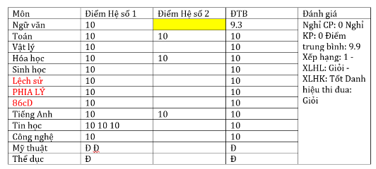

# Awesome-Table-Recognition
Original Code is [Lore](https://github.com/AlibabaResearch/AdvancedLiterateMachinery/tree/main/DocumentUnderstanding/LORE-TSR)
I modified this code with faster inference and higher accuracy by removing locations regression and add a simple and efficient postprocess

### Install 
```
export PATH="/usr/local/cuda-11.8/bin:$PATH"
export LD_LIBRARY_PATH=/usr/local/cuda-11.8/lib64${LD_LIBRARY_PATH:+:${LD_LIBRARY_PATH}}
source ~/.bashrc
conda create --name Lore python=3.7
conda activate Lore
pip install -r requirements.txt
pip install torch==1.6.0+cu101 torchvision==0.7.0+cu101 -f https://download.pytorch.org/whl/torch_stable.html
chmod +x  *.sh
cd lib/models/networsk/DCNv2
python3 setup.py build develop
```
#### Note: if It causes error : Unknown CUDA arch (8.9,9.0,...) or GPU not supported --> export TORCH_CUDA_ARCH_LIST=7.5 or export TORCH_CUDA_ARCH_LIST=6.0 .The rerun setup.py

### Weights
Available model weights (using dla-34 backbone):

| Name | Backbone | Regressor Arc | Image Size | Checkpoint | 
| :---:| :---:| :---: | :---: | :---: |
|ckpt_wtw| DLA-34 | 4+4 | 1024 |[Trained on WTW](https://drive.google.com/file/d/1n33c9jmGmjSfRbheleE1pqiIXBb_BCEw/view?usp=sharing)|
|ckpt_ptn| DLA-34 | 3+3 | 512 | [Trained on PubTabNet](https://drive.google.com/file/d/1hg5R42u_6xaoO-6Ft18Ctu86HB_N2Bzu/view?usp=sharing)|
|ckpt_wireless| ResNet-18 | 4+4 | 768 | [Trained on Wireless Tables](https://drive.google.com/file/d/1cBaewRwlZF1tIZovT49HpJZ5wlb3nSCw/view?usp=sharing)*|


### Inference
```
python inference.py
```
### Result
#### Table Sample


#### Result Sample

### Table Detection
Datset [TableBank](https://github.com/doc-analysis/TableBank) and [WTW](https://github.com/wangwen-whu/wtw-dataset)
Availabel Dataset for training Yolo in [Here](https://drive.google.com/drive/folders/10FTDBGsErTH4OkNXAbCCA-cuUr1-XPau?usp=sharing)
